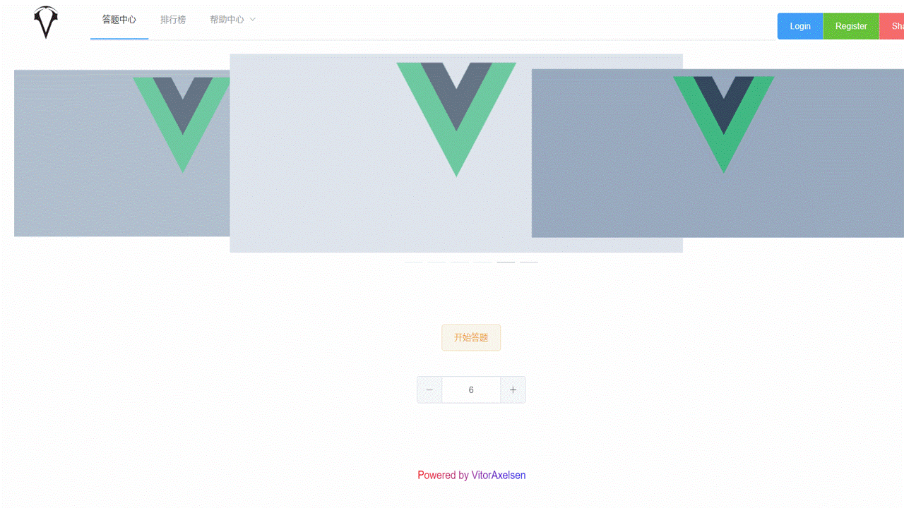
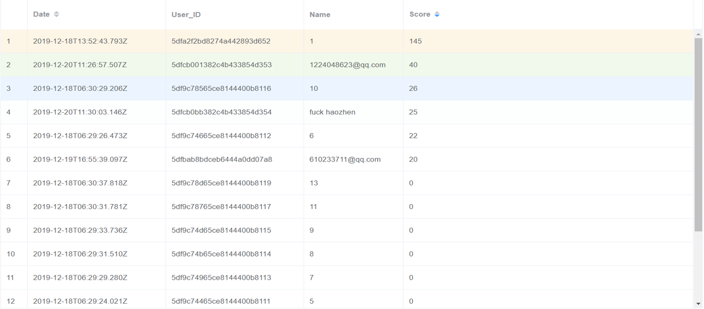
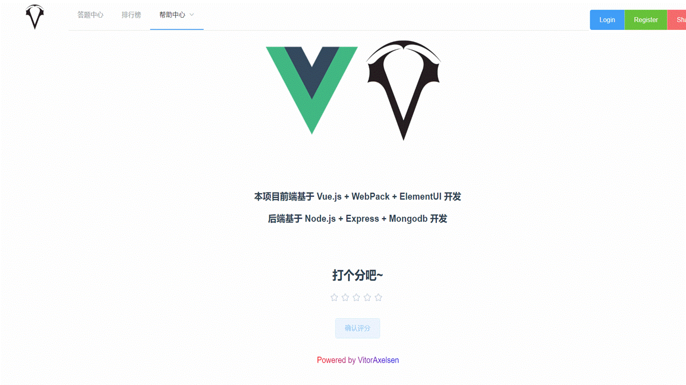
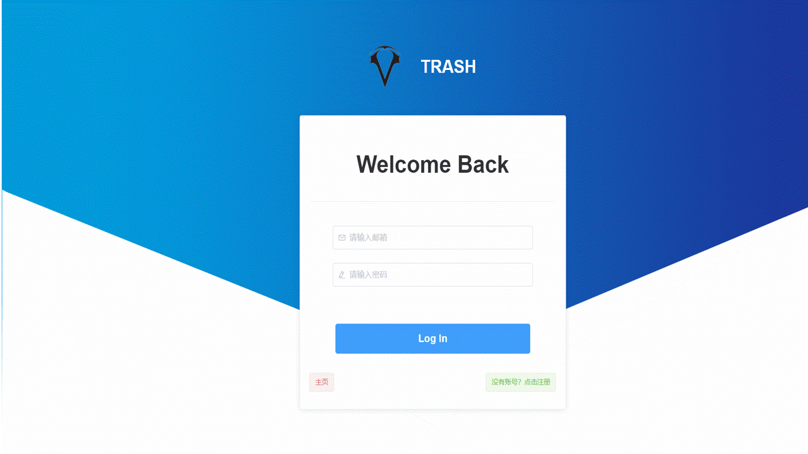
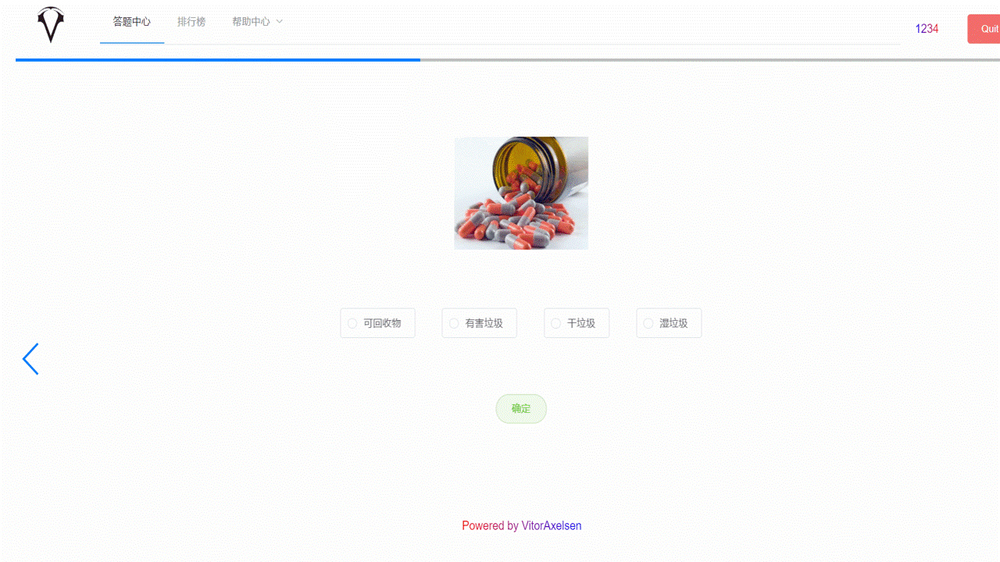

# Vue_Q-A_Website

A garbage classification Q&A WebSiteBased on Vue、WebPack、ElementUI、NodeJS、MongoDB and some other frameworks

## Front-end

- Vue 2.0

- ElementUI

- WebPack

## Back-end

- NodeJS

- Express

- MongoDB

# Quick Start

Enter corresponding directory and run 'npm install'

Something about others I don't know

That's it, anyway

hiahiahia (*￣▽￣*)ブ

# Overview

